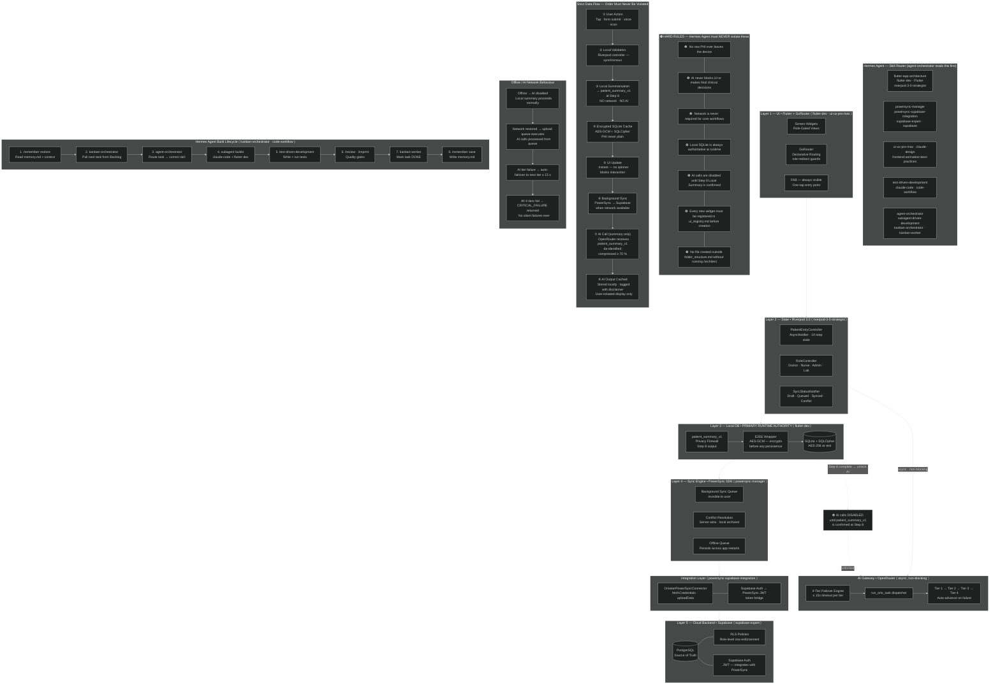

# ORIOSTER — AI POWERED HMS
## MERGED CONTEXT FILE — VERSION 3.0

> This file merges all 5 ORIOSTER context files into a single document.
> Source files: overview.md, architecture.mmd, library_docs.md, folder_structure.md, code_standards.md
> Note: folder_structure.md and code_standards.md were extracted from PDF and may contain minor formatting artifacts.

---

# FILE 1: OVERVIEW.MD

# ORIOSTER - AI POWERED HMS — PRODUCT OVERVIEW.MD
## VERSION 3.0

---

## 1. PRODUCT IDENTITY

**ORIOSTER** IS AN **OFFLINE-FIRST, AI-ASSISTED, MULTI-TENANT HOSPITAL MANAGEMENT SYSTEM (HMS)** ENGINEERED
FOR LOW-RESOURCE HEALTHCARE ENVIRONMENTS. IT OPERATES AS A LOCAL-FIRST CLINICAL OPERATING SYSTEM WITH
ASYNCHRONOUS AI AUGMENTATION — NOT A CLOUD-DEPENDENT SAAS TOOL.

> **CORE DESIGN PHILOSOPHY:**
> OFFLINE-FIRST · CACHE-FIRST · HUMAN-CONTROLLED · AI IS ASSISTIVE, NEVER AUTHORITATIVE.

---

## 2. TARGET ENVIRONMENTS

ORIOSTER IS PURPOSE-BUILT FOR SETTINGS WHERE NETWORK CONNECTIVITY IS INTERMITTENT OR UNAVAILABLE:

| ENVIRONMENT           | DESCRIPTION                                              |
|-----------------------|----------------------------------------------------------|
| REMOTE MEDICAL CAMPS  | FIELD OPERATIONS, DISASTER RELIEF, REFUGEE CAMPS         |
| COMMUNITY CLINICS     | PRIMARY CARE, RURAL OUTPOSTS, MOBILE HEALTH UNITS        |
| DISTRICT HOSPITALS    | MULTI-ROLE STAFF, MODERATE PATIENT VOLUME, LIMITED IT    |

---

## 3. TARGET USERS & ROLES

| ROLE            | CODE  | PRIMARY FUNCTION                                                          |
|-----------------|-------|---------------------------------------------------------------------------|
| DOCTOR          | `DOC` | CLINICAL DECISIONS, DIAGNOSIS CONFIRMATION, PRESCRIPTION REVIEW, AI REVIEW |
| NURSE           | `NUR` | PATIENT INTAKE, VITALS RECORDING, ENTRY WIZARD EXECUTION (STEPS 1–7)      |
| ADMINISTRATOR   | `ADM` | SCHEDULING, INVOICING, STAFF MANAGEMENT, AI HUB ACCESS                    |
| LAB TECHNICIAN  | `LAB` | LAB REPORT PARAMETER ENTRY, AI ANALYSIS TRIGGER                           |

---

## 4. IN-SCOPE FEATURES

### CORE CLINICAL WORKFLOWS
- 10-STEP PATIENT ENTRY WIZARD (PATIENTENTRYWIZARD)
- VITALS RECORDING WITH LOCAL TRIAGE LOGIC (NO AI REQUIRED)
- CHIEF COMPLAINT CAPTURE (STRUCTURED DROPDOWN + OPTIONAL FREE-TEXT)
- PAST HISTORY TAGGING (STRUCTURED TAGS + CAPPED NOTES)
- ONGOING MEDICATION TRACKING WITH DUPLICATE AND INTERACTION WARNINGS
- HYPERSENSITIVITY / ALLERGY RECORDING WITH SEVERITY TAGGING
- APPOINTMENT SCHEDULING AND DOCTOR ASSIGNMENT WITH TIME SLOTS
- ROLE-BASED DASHBOARDS (DOCTOR / NURSE / ADMIN / LAB TECHNICIAN)

### AI-ASSISTED MODULES (ORIO AI)
- DIFFERENTIAL DIAGNOSIS — 3 MOST-PROBABLE DIAGNOSES WITH CONFIDENCE METER
- TREATMENT PLAN GENERATION (POST DOCTOR-CONFIRMED DIAGNOSIS)
- PRESCRIPTION GENERATION (DOCTOR-CONFIRMED, CUSTOMIZABLE, EXPORT-READY)
- LAB REPORT ANALYSIS — PARAMETRIC ENTRY + AI CLINICAL FEEDBACK ADVISORY
- INVOICE GENERATION — AI-FILLED, FIXED TEMPLATE, ITEMIZED
- AI HUB — CENTRAL COMMAND MODULE FOR INVOICE, LABS, PRESCRIPTION, MEDICAL CERTIFICATE

### INFRASTRUCTURE
- OFFLINE-FIRST SYNC VIA POWERSYNC SDK (BACKGROUND, INVISIBLE TO USER)
- ROLE-BASED ACCESS CONTROL (RBAC) ENFORCED AT RLS + ROUTER LEVEL
- END-TO-END ENCRYPTION (E2EE) ON ALL CLINICAL DATA VIA AES-GCM
- MULTI-TENANT ARCHITECTURE — DATA PARTITIONED PER FACILITY AND ROLE
- SQLCIPHER AES-256 ENCRYPTION AT REST

---

## 5. OUT-OF-SCOPE (HARD EXCLUSIONS)

| EXCLUSION                          | REASON                                                               |
|------------------------------------|----------------------------------------------------------------------|
| REAL-TIME CLOUD-ONLY FEATURES      | VIOLATES OFFLINE-FIRST PRINCIPLE — NETWORK MUST NEVER BE REQUIRED    |
| BILLING SAAS / PAYMENT GATEWAY     | OUTSIDE CLINICAL SCOPE                                               |
| RAW PHI SENT TO ANY AI MODEL       | PRIVACY HARD-VIOLATION — BLOCKED AT STEP 8 PRIVACY FIREWALL         |
| AI AS SOLE CLINICAL DECISION-MAKER | AI IS ADVISORY ONLY — DOCTOR HAS FINAL SAY ON EVERY CLINICAL OUTPUT  |
| CONSUMER-FACING PATIENT PORTAL     | ORIOSTER IS A STAFF-FACING CLINICAL TOOL ONLY                        |
| INSURANCE CLAIM PROCESSING         | OUT OF SCOPE FOR V2.0                                                |

---

## 6. PRIVACY GUARANTEES (NON-NEGOTIABLE)

1. **NO RAW PHI LEAVES THE DEVICE** — EVER, UNDER ANY CIRCUMSTANCE, FOR ANY REASON.
2. **AI RECEIVES ONLY `PATIENT_SUMMARY_V1`** — A DE-IDENTIFIED, COMPRESSED (≥70%) SUMMARY
   GENERATED FULLY LOCALLY AT STEP 8.
3. **AI CALLS ARE HARD-DISABLED UNTIL STEP 8 IS COMPLETE** — ENFORCED BY A CONTROLLER-LEVEL GUARD
   THAT CANNOT BE BYPASSED FROM ANY UI LAYER.
4. **ALL CLINICAL DATA IS AES-256 ENCRYPTED AT REST** (SQLCIPHER) AND AES-GCM ENCRYPTED
   BEFORE SYNC (E2EE VIA DART CRYPTOGRAPHY PACKAGE).
5. **AI LOGS ARE ENCRYPTED, SCOPED PER USER, AND PHI-SAFE** BEFORE WRITING TO ANY LOG SINK.

---

## 7. SYSTEM-LEVEL CONSTRAINTS

| CONSTRAINT                           | RULE                                                    |
|--------------------------------------|---------------------------------------------------------|
| NETWORK DEPENDENCY                   | NETWORK IS NEVER REQUIRED FOR CORE CLINICAL WORKFLOWS   |
| UI BLOCKING                          | AI RESPONSES AND NETWORK CALLS NEVER BLOCK UI           |
| FRAME RATE                           | 60 FPS MUST BE MAINTAINED ON GLASSMORPHISM AT ALL TIMES |
| FAILURE HANDLING                     | ALL OPERATIONS DEGRADE GRACEFULLY — NO SILENT FAILURES  |
| AI OUTPUT                            | EVERY AI OUTPUT TAGGED WITH MANDATORY DISCLAIMER CHIP   |
| SYNC AUTHORITY                       | LOCAL SQLITE IS ALWAYS THE RUNTIME AUTHORITY            |

---

## 8. AI PHILOSOPHY SUMMARY

> ORIOSTER'S AI LAYER (ORIO AI) IS A **CLINICAL DECISION SUPPORT** TOOL — NEVER A REPLACEMENT
> FOR CLINICAL JUDGMENT. IT IS SANDBOXED BEHIND THE STEP 8 PRIVACY FIREWALL, DISABLED WHEN
> OFFLINE, ASYNCHRONOUS AND NON-BLOCKING AT ALL TIMES, AND EVERY SINGLE OUTPUT IS TAGGED,
> DISCLAIMERED, AND LOGGED.
>
> **THE DOCTOR ALWAYS HAS THE FINAL SAY.**

---

## 9. HERMES AGENT — SKILL ROUTING TABLE

HERMES AGENT BUILDS THIS APP USING THE SKILL SET BELOW. BEFORE STARTING ANY TASK, THE
`AGENT-ORCHESTRATOR` SKILL READS THIS TABLE AND ROUTES EACH DOMAIN TO THE CORRECT SKILL.

> **RULE:** NEVER START CODING WITHOUT FIRST CONSULTING THE RELEVANT SKILL(S) FOR THAT DOMAIN.
> THE `CODE-WORKFLOW` SKILL GOVERNS HOW TASKS ARE DECOMPOSED AND SEQUENCED.

| DOMAIN                          | PRIMARY SKILL(S)                                    | SECONDARY SKILL(S)                         |
|---------------------------------|-----------------------------------------------------|--------------------------------------------|
| APP-LEVEL ARCHITECTURE PLANNING | `FLUTTER-APP-ARCHITECTURE`                          | `AGENT-ORCHESTRATOR`                       |
| STATE MANAGEMENT (RIVERPOD)     | `RIVERPOD-3-0-STRATEGIST`                           | `FLUTTER-DEV`                              |
| FLUTTER WIDGET & SCREEN CODE    | `FLUTTER-DEV`, `FLUTTER`                            | `CLAUDE-CODE`                              |
| POWERSYNC SCHEMA & CONNECTORS   | `POWERSYNC-MANAGER`                                 | `POWERSYNC-SUPABASE-INTEGRATION`           |
| SUPABASE SCHEMA, RLS, AUTH      | `SUPABASE-EXPERT`, `SUPABASE`                       | `POWERSYNC-SUPABASE-INTEGRATION`           |
| POWERSYNC ↔ SUPABASE WIRING     | `POWERSYNC-SUPABASE-INTEGRATION`                    | `POWERSYNC-MANAGER`, `SUPABASE-EXPERT`     |
| UI DESIGN & GLASSMORPHISM       | `UI-UX-PRO-MAX`, `CLAUDE-DESIGN`                    | `FRONTEND-ANIMATION-BEST-PRACTICES`        |
| ANIMATION & 60 FPS PERFORMANCE  | `FRONTEND-ANIMATION-BEST-PRACTICES`                 | `UI-UX-PRO-MAX`                            |
| CODE GENERATION & FILE WRITES   | `CLAUDE-CODE`                                       | `FLUTTER-DEV`, `CODE-WORKFLOW`             |
| TEST COVERAGE (WIDGET + UNIT)   | `TEST-DRIVEN-DEVELOPMENT`                           | `FLUTTER-DEV`                              |
| MULTI-AGENT TASK ORCHESTRATION  | `AGENT-ORCHESTRATOR`                                | `SUBAGENT-DRIVEN-DEVELOPMENT`              |
| SUBAGENT TASK EXECUTION         | `SUBAGENT-DRIVEN-DEVELOPMENT`, `KANBAN-WORKER`      | `CODE-WORKFLOW`                            |
| SPRINT & KANBAN MANAGEMENT      | `KANBAN-ORCHESTRATOR`                               | `AGENT-ORCHESTRATOR`                       |
| CODE WORKFLOW & FILE SEQUENCING | `CODE-WORKFLOW`                                     | `CLAUDE-CODE`                              |

---

## 10. HERMES AGENT — ORCHESTRATION RULES

THESE RULES GOVERN HOW HERMES AGENT MANAGES THE BUILD LIFECYCLE ACROSS SESSIONS.

### 10.1 PRE-BUILD CHECKLIST (EVERY SESSION)
BEFORE WRITING ANY CODE, HERMES AGENT MUST:
1. INVOKE `AGENT-ORCHESTRATOR` → READ `PROGRESS_TRACKER.MD` TO IDENTIFY CURRENT KANBAN COLUMN
2. INVOKE `CODE-WORKFLOW` → READ `MEMORY.MD` IF IT EXISTS (PRIOR SESSION STATE)
3. READ `ARCHITECTURE.MMD`, `FOLDER_STRUCTURE.MD`, AND `CODE_STANDARDS.MD`
4. READ `UI_REGISTRY.MD` BEFORE WRITING ANY UI COMPONENT
5. READ `UI_TOKENS.MD` BEFORE WRITING ANY WIDGET CODE
6. ROUTE THE CURRENT TASK TO THE CORRECT PRIMARY SKILL PER §9 ABOVE

### 10.2 DURING BUILD
- `KANBAN-WORKER` UPDATES THE TASK STATUS IN `PROGRESS_TRACKER.MD` AS WORK PROGRESSES
- `CLAUDE-CODE` WRITES CODE; `FLUTTER-DEV` ENFORCES PATTERNS; `CODE-WORKFLOW` MAINTAINS FILE ORDER
- `AGENT-ORCHESTRATOR` COORDINATES IF MULTIPLE DOMAINS ARE TOUCHED IN ONE TASK
- `SUBAGENT-DRIVEN-DEVELOPMENT` HANDLES TASKS THAT REQUIRE PARALLELISM ACROSS FEATURES

### 10.3 AFTER EACH FEATURE
1. `TEST-DRIVEN-DEVELOPMENT` → WRITE REQUIRED WIDGET AND UNIT TESTS
2. `UI-UX-PRO-MAX` + `CLAUDE-DESIGN` → RUN `/IMPRINT` ON ANY NEW UI COMPONENT
3. `CODE-WORKFLOW` → RUN `/REVIEW` AGAINST `CODE_STANDARDS.MD` AND `ARCHITECTURE.MMD`
4. `KANBAN-ORCHESTRATOR` → MOVE TASK TO DONE COLUMN IN `PROGRESS_TRACKER.MD`
5. `CODE-WORKFLOW` → RUN `/REMEMBER SAVE` TO WRITE `MEMORY.MD`

### 10.4 FAILURE HANDLING
- IF A BUILD FAILS, INVOKE `RECOVER` SKILL BEFORE CONTINUING
- IF SESSION CONTEXT IS POLLUTED, `KANBAN-ORCHESTRATOR` LOGS A RESET NOTE AND STARTS FRESH
- `AGENT-ORCHESTRATOR` PREVENTS CONCURRENT BUILDS THAT TOUCH THE SAME CONTROLLER OR SERVICE FILE

---

## 11. VERSION HISTORY

| VERSION | FRAMEWORK ALIGNMENT              | NOTES                                              |
|---------|----------------------------------|----------------------------------------------------|
| V1.0    | ORIGINAL HMS SPEC                | AI TRIGGERED POST-SUBMIT ONLY                      |
| V2.0    | 2026 ADVANCED AGENTIC FRAMEWORK  | AI AT STEP 9, 9 CONTEXT FILES, 5 AGENT SKILLS      |
| V3.0    | HERMES AGENTIC FRAMEWORK         | 18 HERMES SKILLS, KANBAN WORKFLOW, SUBAGENT ROUTING |


---

# FILE 2: ARCHITECTURE.MMD



---

# FILE 3: LIBRARY_DOCS.MD

# ORIOSTER – AI POWERED HMS — LIBRARY_DOCS.MD
## VERSION 3.0

> THESE ARE NOT GENERIC LIBRARY DOCS. THESE ARE THE **EXACT ORIOSTER-SPECIFIC WIRING CONTRACTS**
> FOR EACH DEPENDENCY. HERMES FOLLOWS THESE PRECISELY — NO IMPROVISATION, NO SUBSTITUTION.
> RUN `/ARCHITECT` BEFORE WRITING ANY CONNECTOR CLASS. RUN `/REVIEW` AFTER.

---

## HERMES AGENT SKILLS GOVERNING THIS FILE

| SKILL | SCOPE |
|---|---|
| `POWERSYNC-MANAGER` | ALL POWERSYNC SCHEMA, CONNECTOR, AND SYNC RULE AUTHORING |
| `SUPABASE-EXPERT` | ALL SUPABASE SQL SETUP, RLS POLICIES, AUTH INTEGRATION |
| `POWERSYNC-SUPABASE-INTEGRATION` | THE BRIDGE BETWEEN POWERSYNC AND SUPABASE — CREDENTIALS, UPLOAD, PUBLICATIONS |
| `SUPABASE` | SUPABASE CLIENT INITIALIZATION, QUERY PATTERNS, JWT CLAIMS |
| `FLUTTER-DEV` | PUBSPEC.YAML DEPENDENCY MANAGEMENT AND SDK CONSTRAINTS |
| `CODE-WORKFLOW` | ENFORCES READ-BEFORE-WRITE: ALWAYS READ THIS FILE BEFORE TOUCHING DATA LAYER FILES |

> **HERMES ACTIVATION RULE:** WHEN WORKING ON ANYTHING INSIDE `LIB/DATA/` OR `LIB/CORE/`,
> HERMES MUST ACTIVATE `POWERSYNC-MANAGER` + `SUPABASE-EXPERT` BEFORE WRITING A SINGLE LINE.
> WHEN WRITING THE CONNECTOR CLASS SPECIFICALLY, ALSO ACTIVATE `POWERSYNC-SUPABASE-INTEGRATION`.

---

## PUBSPEC.YAML — REQUIRED DEPENDENCIES

```YAML
DEPENDENCIES:
  FLUTTER:
    SDK: FLUTTER

  # STATE MANAGEMENT — RIVERPOD 3.0
  # [HERMES: ACTIVATE RIVERPOD-3-0-STRATEGIST BEFORE EDITING STATE LAYER]
  FLUTTER_RIVERPOD: ^3.0.0
  RIVERPOD_ANNOTATION: ^3.0.0

  # ROUTING
  GO_ROUTER: ^14.0.0

  # LOCAL DB + SYNC
  # [HERMES: ACTIVATE POWERSYNC-MANAGER + POWERSYNC-SUPABASE-INTEGRATION]
  POWERSYNC: ^1.6.0
  SUPABASE_FLUTTER: ^2.8.0
  SQLITE3_FLUTTER_LIBS: ^0.5.24
  SQFLITE_SQLCIPHER: ^2.2.1     # SQLCIPHER AES-256 AT REST

  # ENCRYPTION
  CRYPTOGRAPHY: ^2.7.0           # AES-GCM E2EE
  FLUTTER_SECURE_STORAGE: ^9.2.0 # KEY STORAGE

  # NETWORKING (OPENROUTER)
  HTTP: ^1.2.2

  # LOGGING
  LOGGER: ^2.4.0

  # PATH UTILITIES
  PATH_PROVIDER: ^2.1.3
  PATH: ^1.9.0

DEV_DEPENDENCIES:
  FLUTTER_TEST:
    SDK: FLUTTER
  # [HERMES: ACTIVATE TEST-DRIVEN-DEVELOPMENT FOR ALL TEST SCAFFOLDING]
  RIVERPOD_GENERATOR: ^3.0.0
  BUILD_RUNNER: ^2.4.12
  FLUTTER_LINTS: ^4.0.0
  MOCKTAIL: ^1.0.3
```

---

1. POWERSYNC SDK

HERMES: ACTIVATE POWERSYNC-MANAGER SKILL BEFORE WRITING ANY CODE IN THIS SECTION.

PURPOSE

BACKGROUND SYNC ENGINE. QUEUES LOCAL WRITES WHEN OFFLINE AND UPLOADS TO SUPABASE WHEN NETWORK
RETURNS. HANDLES CONFLICT RESOLUTION (SERVER WINS). USER IS NEVER AWARE OF SYNC OPERATIONS.

DART SCHEMA (LIB/DATA/LOCAL/POWERSYNC/POWERSYNC_SCHEMA.DART)

```DART
// [HERMES: POWERSYNC-MANAGER GOVERNS THIS FILE]
// MIRROR EVERY SUPABASE TABLE EXACTLY — COLUMN NAMES MUST MATCH POSTGRESQL SCHEMA
IMPORT 'PACKAGE:POWERSYNC/POWERSYNC.DART';

CONST PATIENTSTABLE = TABLE('PATIENTS', [
  COLUMN.TEXT('LOCAL_ID'),            // DEVICE-GENERATED UUID (PRIMARY KEY FOR OFFLINE OPS)
  COLUMN.TEXT('FULL_NAME'),
  COLUMN.TEXT('GENDER'),              // MALE | FEMALE | OTHER
  COLUMN.TEXT('DATE_OF_BIRTH'),       // ISO 8601
  COLUMN.TEXT('CONTACT'),
  COLUMN.TEXT('ADDRESS'),
  COLUMN.TEXT('LOCAL_ID_NUMBER'),     // CAMP/CLINIC LOCAL ID — NOT NATIONAL ID
  COLUMN.TEXT('TENANT_ID'),           // FACILITY/ORGANIZATION ID
  COLUMN.INTEGER('CONSENT_GIVEN'),    // 1 = GIVEN, 0 = NOT GIVEN
  COLUMN.TEXT('DUPLICATE_CHECK_HASH'),// HASH OF NAME+DOB FOR DUPLICATE DETECTION
  COLUMN.TEXT('SYNC_STATUS'),         // DRAFT | QUEUED | SYNCED | CONFLICT
  COLUMN.TEXT('CREATED_AT'),          // ISO 8601
  COLUMN.TEXT('CREATED_BY'),          // STAFF USER_ID
]);

CONST VITALSTABLE = TABLE('VITALS', [
  COLUMN.TEXT('PATIENT_ID'),          // FOREIGN KEY → PATIENTS.LOCAL_ID
  COLUMN.REAL('TEMPERATURE'),         // CELSIUS
  COLUMN.REAL('BP_SYSTOLIC'),
  COLUMN.REAL('BP_DIASTOLIC'),
  COLUMN.REAL('HEART_RATE'),          // BPM
  COLUMN.REAL('SPO2'),                // PERCENT
  COLUMN.REAL('WEIGHT_KG'),
  COLUMN.REAL('HEIGHT_CM'),
  COLUMN.TEXT('TRIAGE_LEVEL'),        // GREEN | YELLOW | RED (LOCALLY COMPUTED)
  COLUMN.TEXT('RECORDED_AT'),
  COLUMN.TEXT('RECORDED_BY'),
]);

CONST STAFFTABLE = TABLE('STAFF', [
  COLUMN.TEXT('USER_ID'),             // SUPABASE AUTH.UID()
  COLUMN.TEXT('ROLE'),                // DOCTOR | NURSE | ADMIN | LAB_TECH
  COLUMN.TEXT('FULL_NAME'),
  COLUMN.TEXT('TENANT_ID'),
  COLUMN.INTEGER('IS_ACTIVE'),
]);

CONST APPOINTMENTSTABLE = TABLE('APPOINTMENTS', [
  COLUMN.TEXT('PATIENT_ID'),
  COLUMN.TEXT('DOCTOR_ID'),
  COLUMN.TEXT('SCHEDULED_AT'),        // ISO 8601
  COLUMN.TEXT('STATUS'),              // SCHEDULED | IN_PROGRESS | COMPLETED | CANCELLED
  COLUMN.TEXT('TENANT_ID'),
]);

CONST PATIENTSUMMARIESTABLE = TABLE('PATIENT_SUMMARIES', [
  COLUMN.TEXT('PATIENT_ID'),          // FOREIGN KEY → PATIENTS.LOCAL_ID
  COLUMN.TEXT('ENCRYPTED_SUMMARY'),   // AES-GCM ENCRYPTED PATIENT_SUMMARY_V1
  COLUMN.TEXT('CREATED_AT'),
  COLUMN.TEXT('CREATED_BY'),
]);

CONST SCHEMA = SCHEMA([
  PATIENTSTABLE,
  VITALSTABLE,
  STAFFTABLE,
  APPOINTMENTSTABLE,
  PATIENTSUMMARIESTABLE,
]);
```

DATABASE SERVICE (LIB/DATA/LOCAL/POWERSYNC/POWERSYNC_DATABASE.DART)

```DART
// [HERMES: POWERSYNC-MANAGER + FLUTTER-DEV GOVERN THIS FILE]
IMPORT 'PACKAGE:POWERSYNC/POWERSYNC.DART';
IMPORT 'PACKAGE:PATH_PROVIDER/PATH_PROVIDER.DART';
IMPORT 'PACKAGE:PATH/PATH.DART' AS P;
IMPORT 'POWERSYNC_SCHEMA.DART';

CLASS POWERSYNCDATABASESERVICE {
  POWERSYNCDATABASESERVICE._();
  STATIC FINAL POWERSYNCDATABASESERVICE INSTANCE = POWERSYNCDATABASESERVICE._();

  LATE POWERSYNCDATABASE _DB;
  POWERSYNCDATABASE GET DB => _DB;

  FUTURE<VOID> INITIALIZE(POWERSYNCBACKENDCONNECTOR CONNECTOR) ASYNC {
    FINAL DIR = AWAIT GETAPPLICATIONDOCUMENTSDIRECTORY();
    FINAL DBPATH = P.JOIN(DIR.PATH, 'ORIOSTER.DB');

    _DB = POWERSYNCDATABASE(SCHEMA: SCHEMA, PATH: DBPATH);
    AWAIT _DB.INITIALIZE();
    AWAIT _DB.CONNECT(CONNECTOR: CONNECTOR);
  }
}
```

BACKEND CONNECTOR (LIB/DATA/REMOTE/POWERSYNC/ABSTRACT_POWERSYNC_BACKEND_CONNECTOR.DART)

HERMES: ACTIVATE POWERSYNC-SUPABASE-INTEGRATION SKILL FOR THIS CLASS.
THIS IS WHERE POWERSYNC AND SUPABASE ARE BRIDGED. BOTH SKILLS MUST BE ACTIVE.

```DART
// [HERMES: POWERSYNC-SUPABASE-INTEGRATION GOVERNS THIS FILE]
IMPORT 'PACKAGE:POWERSYNC/POWERSYNC.DART';
IMPORT 'PACKAGE:SUPABASE_FLUTTER/SUPABASE_FLUTTER.DART';

CLASS ORIOSTERPOWERSYNCCONNECTOR EXTENDS POWERSYNCBACKENDCONNECTOR {

  @OVERRIDE
  FUTURE<POWERSYNCCREDENTIALS?> FETCHCREDENTIALS() ASYNC {
    FINAL SESSION = SUPABASE.INSTANCE.CLIENT.AUTH.CURRENTSESSION;
    IF (SESSION == NULL) RETURN NULL;

    RETURN POWERSYNCCREDENTIALS(
      ENDPOINT: CONST STRING.FROMENVIRONMENT('POWERSYNC_URL'),
      TOKEN: SESSION.ACCESSTOKEN,
      USERID: SESSION.USER.ID,
      EXPIRESAT: SESSION.EXPIRESAT != NULL
          ? DATETIME.FROMMILLISECONDSSINCEEPOCH(SESSION.EXPIRESAT! * 1000)
          : NULL,
    );
  }

  @OVERRIDE
  FUTURE<VOID> UPLOADDATA(POWERSYNCDATABASE DATABASE) ASYNC {
    FINAL BATCH = AWAIT DATABASE.GETCRUDBATCH(LIMIT: 100);
    IF (BATCH == NULL) RETURN;

    FOR (FINAL OP IN BATCH.CRUD) {
      FINAL DATA = OP.OPDATA ?? {};
      SWITCH (OP.OP) {
        CASE UPDATETYPE.PUT:
        CASE UPDATETYPE.PATCH:
          AWAIT SUPABASE.INSTANCE.CLIENT
              .FROM(OP.TABLE)
              .UPSERT(DATA);
        CASE UPDATETYPE.DELETE:
          AWAIT SUPABASE.INSTANCE.CLIENT
              .FROM(OP.TABLE)
              .DELETE()
              .EQ('ID', OP.ID);
      }
    }
    AWAIT BATCH.COMPLETE();
  }
}
```

APP STARTUP INITIALIZATION (LIB/APP/APP_BOOTSTRAPPER.DART)

```DART
// [HERMES: SUPABASE-EXPERT + POWERSYNC-MANAGER BOTH ACTIVE FOR THIS INIT SEQUENCE]
IMPORT 'PACKAGE:SUPABASE_FLUTTER/SUPABASE_FLUTTER.DART';
IMPORT 'PACKAGE:ORIOSTER/DATA/REMOTE/POWERSYNC/ABSTRACT_POWERSYNC_BACKEND_CONNECTOR.DART';
IMPORT 'PACKAGE:ORIOSTER/DATA/LOCAL/POWERSYNC/POWERSYNC_DATABASE.DART';

FUTURE<VOID> INITIALIZESERVICES() ASYNC {
  AWAIT SUPABASE.INITIALIZE(
    URL: CONST STRING.FROMENVIRONMENT('SUPABASE_URL'),
    ANONKEY: CONST STRING.FROMENVIRONMENT('SUPABASE_ANON_KEY'),
  );
  FINAL CONNECTOR = ORIOSTERPOWERSYNCCONNECTOR();
  AWAIT POWERSYNCDATABASESERVICE.INSTANCE.INITIALIZE(CONNECTOR);
}
```

CRITICAL RULES — POWERSYNC

· ❌ NEVER USE THE SUPABASE CONNECTION POOLER (PORT 6543) FOR POWERSYNC
· ✅ ALWAYS USE THE DIRECT SUPABASE URI (PORT 5432)
· ✅ RUN /RECOVER IMMEDIATELY IF SYNC ENTERS AN ERROR LOOP
· ✅ BACK UP AGENTS.MMD BEFORE ANY POWERSYNC CLI INIT COMMAND
· ✅ HERMES ACTIVATES POWERSYNC-MANAGER BEFORE CLI WORK; CODE-WORKFLOW GOVERNS BACKUP STEPS

SYNC RULES YAML (POWERSYNC CLOUD DASHBOARD)

HERMES: USE POWERSYNC-MANAGER SKILL TO AUTHOR AND VALIDATE ALL SYNC RULE DEFINITIONS.

```YAML
BUCKET_DEFINITIONS:
  BY_TENANT_AND_ROLE:
    # PARAMETERIZED PER AUTHENTICATED USER
    PARAMETERS: >
      SELECT ROLE, TENANT_ID
      FROM STAFF
      WHERE USER_ID = TOKEN_PARAMETERS.USER_ID
    DATA:
      # DOCTORS AND ADMINS: ALL PATIENTS IN THEIR TENANT
      - >
        SELECT * FROM PATIENTS
        WHERE TENANT_ID = BUCKET.TENANT_ID
        AND (BUCKET.ROLE = 'DOCTOR' OR BUCKET.ROLE = 'ADMIN')
      # NURSES: ONLY PATIENTS THEY CREATED OR ARE ASSIGNED TO
      - >
        SELECT * FROM PATIENTS
        WHERE TENANT_ID = BUCKET.TENANT_ID
        AND (CREATED_BY = TOKEN_PARAMETERS.USER_ID
          OR ASSIGNED_NURSE_ID = TOKEN_PARAMETERS.USER_ID)
        AND BUCKET.ROLE = 'NURSE'
      # VITALS: FOLLOW PATIENT ACCESS
      - >
        SELECT V.* FROM VITALS V
        JOIN PATIENTS P ON P.LOCAL_ID = V.PATIENT_ID
        WHERE P.TENANT_ID = BUCKET.TENANT_ID
      # APPOINTMENTS
      - >
        SELECT * FROM APPOINTMENTS
        WHERE TENANT_ID = BUCKET.TENANT_ID
        AND (BUCKET.ROLE IN ('DOCTOR', 'ADMIN', 'NURSE'))
      # PATIENT SUMMARIES: ENCRYPTED, FOLLOWS PATIENT ACCESS
      - >
        SELECT PS.* FROM PATIENT_SUMMARIES PS
        JOIN PATIENTS P ON P.LOCAL_ID = PS.PATIENT_ID
        WHERE P.TENANT_ID = BUCKET.TENANT_ID
```

---

2. SUPABASE

HERMES: ACTIVATE SUPABASE-EXPERT + SUPABASE SKILLS BEFORE ANY WORK IN THIS SECTION.

PURPOSE

CLOUD SOURCE OF TRUTH. POSTGRESQL WITH ROW LEVEL SECURITY ENFORCING ROLE-BASED DATA ACCESS.
SUPABASE AUTH PROVIDES JWT TOKENS USED BY POWERSYNC FOR SYNC AUTHENTICATION.

REQUIRED SQL SETUP (RUN IN SUPABASE SQL EDITOR)

```SQL
-- [HERMES: SUPABASE-EXPERT GOVERNS ALL SQL IN THIS SECTION]

-- ── STEP 1: POWERSYNC REPLICATION ROLE ─────────────────────────────────────
CREATE ROLE POWERSYNC_ROLE
  REPLICATION
  BYPASSRLS
  LOGIN
  PASSWORD 'YOUR_SECURE_PASSWORD_HERE';

GRANT CONNECT ON DATABASE POSTGRES TO POWERSYNC_ROLE;
GRANT USAGE ON SCHEMA PUBLIC TO POWERSYNC_ROLE;
GRANT SELECT ON ALL TABLES IN SCHEMA PUBLIC TO POWERSYNC_ROLE;

-- AUTO-GRANT ON FUTURE TABLES
ALTER DEFAULT PRIVILEGES IN SCHEMA PUBLIC
  GRANT SELECT ON TABLES TO POWERSYNC_ROLE;

-- ── STEP 2: PUBLICATION FOR POWERSYNC ──────────────────────────────────────
CREATE PUBLICATION POWERSYNC
  FOR TABLE PUBLIC.PATIENTS, PUBLIC.VITALS, PUBLIC.STAFF,
            PUBLIC.APPOINTMENTS, PUBLIC.PATIENT_SUMMARIES;

-- ── STEP 3: ROW LEVEL SECURITY ─────────────────────────────────────────────
ALTER TABLE PUBLIC.PATIENTS         ENABLE ROW LEVEL SECURITY;
ALTER TABLE PUBLIC.VITALS           ENABLE ROW LEVEL SECURITY;
ALTER TABLE PUBLIC.APPOINTMENTS     ENABLE ROW LEVEL SECURITY;
ALTER TABLE PUBLIC.PATIENT_SUMMARIES ENABLE ROW LEVEL SECURITY;

-- DOCTORS: ALL PATIENTS IN THEIR TENANT
CREATE POLICY "DOCTORS_READ_ALL_PATIENTS"
  ON PUBLIC.PATIENTS FOR SELECT
  USING (
    AUTH.JWT() ->> 'ROLE' = 'DOCTOR'
    AND TENANT_ID = AUTH.JWT() ->> 'TENANT_ID'
  );

-- NURSES: OWN CREATED + ASSIGNED PATIENTS
CREATE POLICY "NURSES_READ_ASSIGNED_PATIENTS"
  ON PUBLIC.PATIENTS FOR SELECT
  USING (
    AUTH.JWT() ->> 'ROLE' = 'NURSE'
    AND TENANT_ID = AUTH.JWT() ->> 'TENANT_ID'
    AND (
      CREATED_BY = AUTH.UID()
      OR ASSIGNED_NURSE_ID = AUTH.UID()
    )
  );

-- ADMINS: ALL RECORDS IN TENANT
CREATE POLICY "ADMINS_READ_ALL"
  ON PUBLIC.PATIENTS FOR ALL
  USING (
    AUTH.JWT() ->> 'ROLE' = 'ADMIN'
    AND TENANT_ID = AUTH.JWT() ->> 'TENANT_ID'
  );

-- PATIENT SUMMARIES: ENCRYPTED BLOBS, ONLY CREATOR OR ASSIGNED DOCTOR READS
CREATE POLICY "SUMMARIES_CREATOR_ACCESS"
  ON PUBLIC.PATIENT_SUMMARIES FOR SELECT
  USING (
    CREATED_BY = AUTH.UID()
    OR AUTH.JWT() ->> 'ROLE' IN ('DOCTOR', 'ADMIN')
  );

-- ── STEP 4: CUSTOM JWT CLAIMS (ROLE + TENANT_ID) ───────────────────────────
-- ADD THIS HOOK IN SUPABASE AUTH > HOOKS > CUSTOM ACCESS TOKEN
-- RETURNS { "ROLE": "DOCTOR", "TENANT_ID": "UUID" } IN JWT
```

AUTH INTEGRATION (LIB/DATA/REMOTE/SUPABASE/SUPABASE_AUTH_SERVICE.DART)

```DART
// [HERMES: SUPABASE-EXPERT + SUPABASE SKILLS GOVERN THIS FILE]
IMPORT 'PACKAGE:SUPABASE_FLUTTER/SUPABASE_FLUTTER.DART';
IMPORT 'PACKAGE:ORIOSTER/CORE/TYPES/APP_ROLE.DART';

CLASS SUPABASEAUTHSERVICE {
  FINAL _CLIENT = SUPABASE.INSTANCE.CLIENT;

  FUTURE<VOID> SIGNIN({REQUIRED STRING EMAIL, REQUIRED STRING PASSWORD}) ASYNC {
    AWAIT _CLIENT.AUTH.SIGNINWITHPASSWORD(EMAIL: EMAIL, PASSWORD: PASSWORD);
  }

  FUTURE<VOID> SIGNOUT() ASYNC => _CLIENT.AUTH.SIGNOUT();

  STRING? GET CURRENTUSERID => _CLIENT.AUTH.CURRENTUSER?.ID;

  APPROLE? GET CURRENTROLE {
    FINAL JWT = _CLIENT.AUTH.CURRENTSESSION?.USER.USERMETADATA;
    FINAL ROLESTR = JWT?['ROLE'] AS STRING?;
    RETURN APPROLE.FROMSTRING(ROLESTR);
  }

  STREAM<AUTHSTATE> GET AUTHSTATECHANGES => _CLIENT.AUTH.ONAUTHSTATECHANGE;
}
```

---

3. OPENROUTER (ORIO AI GATEWAY)

HERMES: USE FLUTTER-DEV + CLAUDE-CODE SKILLS FOR THIS SERVICE LAYER.
PRIVACY GUARD MUST BE VERIFIED ACTIVE BEFORE ANY CALL. /REVIEW IS MANDATORY AFTER BUILD.

ALL OPENROUTER CLIENT CODE LIVES IN LIB/DATA/REMOTE/OPENROUTER/ PER FOLDER_STRUCTURE.MD.
THE FOLLOWING FOUR FILES MUST BE IMPLEMENTED EXACTLY AS DEFINED BELOW.

3.1 OPENROUTER CLIENT (LIB/DATA/REMOTE/OPENROUTER/OPENROUTER_CLIENT.DART)

```DART
// [HERMES: CLAUDE-CODE + FLUTTER-DEV GOVERN THIS FILE]
IMPORT 'DART:CONVERT';
IMPORT 'PACKAGE:HTTP/HTTP.DART' AS HTTP;
IMPORT 'OPENROUTER_MODEL_ROUTER.DART';
IMPORT 'OPENROUTER_TIMEOUT_POLICY.DART';
IMPORT 'OPENROUTER_JSON_PARSER.DART';
IMPORT 'PACKAGE:ORIOSTER/CORE/ERRORS/APP_EXCEPTION.DART';

CLASS OPENROUTERCLIENT {
  STATIC CONST _BASEURL = 'HTTPS://OPENROUTER.AI/API/V1/CHAT/COMPLETIONS';
  FINAL HTTP.CLIENT _HTTPCLIENT;
  FINAL OPENROUTERMODELROUTER _MODELROUTER;
  FINAL OPENROUTERTIMEOUTPOLICY _TIMEOUTPOLICY;
  FINAL OPENROUTERJSONPARSER _JSONPARSER;

  OPENROUTERCLIENT({
    HTTP.CLIENT? HTTPCLIENT,
    OPENROUTERMODELROUTER? MODELROUTER,
    OPENROUTERTIMEOUTPOLICY? TIMEOUTPOLICY,
    OPENROUTERJSONPARSER? JSONPARSER,
  }) : _HTTPCLIENT = HTTPCLIENT ?? HTTP.CLIENT(),
       _MODELROUTER = MODELROUTER ?? OPENROUTERMODELROUTER(),
       _TIMEOUTPOLICY = TIMEOUTPOLICY ?? CONST OPENROUTERTIMEOUTPOLICY(),
       _JSONPARSER = JSONPARSER ?? OPENROUTERJSONPARSER();

  FUTURE<ORIOAIOUTPUT> RUNORIOTASK({
    REQUIRED STRING TASK,
    REQUIRED STRING PATIENTSUMMARYV1, // ALWAYS DE-IDENTIFIED — VERIFIED BY PHI GUARD
  }) ASYNC {
    // PHI GUARD — HARD BLOCK BEFORE ANY NETWORK CALL
    IF (PRIVACYGUARD.CONTAINSRAWPHI(PATIENTSUMMARYV1)) {
      THROW CONST PHIVIOLATIONERROR();
    }

    FINAL MODELS = _MODELROUTER.GETMODELSFORTASK(TASK);
    EXCEPTION? LASTERROR;
    INT TIERINDEX = 0;

    FOR (FINAL MODEL IN MODELS) {
      TRY {
        TIERINDEX++;
        FINAL RESULT = AWAIT _CALLMODEL(
          MODEL: MODEL,
          TASK: TASK,
          SUMMARY: PATIENTSUMMARYV1,
          TIERINDEX: TIERINDEX,
        ).TIMEOUT(_TIMEOUTPOLICY.TIMEOUTPERTIER);
        RETURN RESULT;
      } ON TIMEOUTEXCEPTION {
        LASTERROR = TIMEOUTEXCEPTION('TIER $TIERINDEX TIMED OUT: $MODEL');
        CONTINUE;
      } ON HTTP.CLIENTEXCEPTION CATCH (E) {
        LASTERROR = E;
        CONTINUE;
      }
    }
    THROW AITIEREXHAUSTEDERROR(TASK: TASK, LASTERROR: LASTERROR);
  }

  FUTURE<ORIOAIOUTPUT> _CALLMODEL({
    REQUIRED STRING MODEL,
    REQUIRED STRING TASK,
    REQUIRED STRING SUMMARY,
    REQUIRED INT TIERINDEX,
  }) ASYNC {
    FINAL PAYLOAD = _BUILDPAYLOAD(MODEL, TASK, SUMMARY);
    FINAL RESPONSE = AWAIT _HTTPCLIENT.POST(
      URI.PARSE(_BASEURL),
      HEADERS: {
        'CONTENT-TYPE': 'APPLICATION/JSON',
        'AUTHORIZATION': 'BEARER ${CONST STRING.FROMENVIRONMENT('OPENROUTER_API_KEY')}',
      },
      BODY: JSONENCODE(PAYLOAD),
    );
    IF (RESPONSE.STATUSCODE != 200) {
      THROW NETWORKERROR('OPENROUTER ERROR: ${RESPONSE.STATUSCODE}');
    }
    FINAL JSONRESPONSE = JSONDECODE(RESPONSE.BODY) AS MAP<STRING, DYNAMIC>;
    RETURN _JSONPARSER.PARSEOUTPUT(JSONRESPONSE, TIERUSED: TIERINDEX, MODELUSED: MODEL);
  }

  MAP<STRING, DYNAMIC> _BUILDPAYLOAD(STRING MODEL, STRING TASK, STRING SUMMARY) {
    RETURN {
      'MODEL': MODEL,
      'MESSAGES': [
        {'ROLE': 'SYSTEM', 'CONTENT': _SYSTEMPROMPTFORTASK(TASK)},
        {'ROLE': 'USER', 'CONTENT': SUMMARY},
      ],
      'RESPONSE_FORMAT': {'TYPE': 'JSON_OBJECT'},
      'TEMPERATURE': 0.2,
    };
  }

  STRING _SYSTEMPROMPTFORTASK(STRING TASK) {
    // RETURNS TASK‑SPECIFIC INSTRUCTIONS ENFORCING THE ADVISORY JSON SCHEMA
    RETURN 'YOU ARE A CLINICAL DECISION SUPPORT ASSISTANT. OUTPUT ONLY VALID JSON MATCHING THE REQUIRED SCHEMA. '
           'THE "RECOMMENDATION_TYPE" FIELD MUST ALWAYS BE "ADVISORY". INCLUDE A DISCLAIMER.';
  }
}
```

3.2 MODEL ROUTER (LIB/DATA/REMOTE/OPENROUTER/OPENROUTER_MODEL_ROUTER.DART)

```DART
// [HERMES: CLAUDE-CODE GOVERNS THIS FILE]
CLASS OPENROUTERMODELROUTER {
  STATIC CONST MAP<STRING, LIST<STRING>> _TIERROUTES = {
    'DIAGNOSIS': [
      'DEEPSEEK/DEEPSEEK-R1:FREE',
      'GOOGLE/GEMINI-2.0-FLASH-THINKING-EXP:FREE',
      'QWEN/QWEN-2.5-72B-INSTRUCT:FREE',
      'META-LLAMA/LLAMA-3.3-70B-INSTRUCT:FREE',
    ],
    'TREATMENT': [
      'GOOGLE/GEMINI-2.0-FLASH-EXP:FREE',
      'DEEPSEEK/DEEPSEEK-CHAT:FREE',
      'META-LLAMA/LLAMA-3.3-70B-INSTRUCT:FREE',
      'QWEN/QWEN-2.5-72B-INSTRUCT:FREE',
    ],
    'RX_GENERATION': [
      'META-LLAMA/LLAMA-3.3-70B-INSTRUCT:FREE',
      'GOOGLE/GEMINI-2.0-FLASH-EXP:FREE',
      'QWEN/QWEN-2.5-72B-INSTRUCT:FREE',
      'GOOGLE/GEMMA-2-9B-IT:FREE',
    ],
    'RX_MONITORING': [
      'QWEN/QWEN-2.5-72B-INSTRUCT:FREE',
      'META-LLAMA/LLAMA-3.3-70B-INSTRUCT:FREE',
      'DEEPSEEK/DEEPSEEK-R1:FREE',
      'MISTRALAI/MISTRAL-NEMO:FREE',
    ],
    'BILLING': [
      'GOOGLE/GEMINI-2.0-FLASH-EXP:FREE',
      'GOOGLE/GEMMA-2-9B-IT:FREE',
      'MISTRALAI/MISTRAL-NEMO:FREE',
      'MICROSOFT/PHI-3-MEDIUM-128K-INSTRUCT:FREE',
    ],
    'SCHEDULING': [
      'META-LLAMA/LLAMA-3.3-70B-INSTRUCT:FREE',
      'GOOGLE/GEMINI-2.0-FLASH-EXP:FREE',
      'DEEPSEEK/DEEPSEEK-CHAT:FREE',
      'MISTRALAI/MISTRAL-SMALL-24B:FREE',
    ],
    'LAB_ANALYSIS': [
      'GOOGLE/GEMINI-2.0-FLASH-EXP:FREE',
      'DEEPSEEK/DEEPSEEK-CHAT:FREE',
      'MICROSOFT/PHI-3-MEDIUM-128K-INSTRUCT:FREE',
      'META-LLAMA/LLAMA-3.3-70B-INSTRUCT:FREE',
    ],
    'IMAGING': [
      'GOOGLE/GEMINI-2.0-FLASH-EXP:FREE',
      'QWEN/QWEN2.5-VL-72B-INSTRUCT:FREE',
      'META-LLAMA/LLAMA-3.2-90B-VISION-INSTRUCT:FREE',
      'META-LLAMA/LLAMA-3.2-11B-VISION-INSTRUCT:FREE',
    ],
  };

  LIST<STRING> GETMODELSFORTASK(STRING TASK) {
    FINAL MODELS = _TIERROUTES[TASK];
    IF (MODELS == NULL) THROW ARGUMENTERROR('UNKNOWN TASK: $TASK');
    RETURN MODELS;
  }
}
```

3.3 TIMEOUT POLICY (LIB/DATA/REMOTE/OPENROUTER/OPENROUTER_TIMEOUT_POLICY.DART)

```DART
// [HERMES: FLUTTER-DEV GOVERNS THIS FILE]
IMPORT 'DART:ASYNC';

CLASS OPENROUTERTIMEOUTPOLICY {
  FINAL DURATION TIMEOUTPERTIER;

  CONST OPENROUTERTIMEOUTPOLICY({THIS.TIMEOUTPERTIER = CONST DURATION(SECONDS: 15)});
}
```

3.4 JSON PARSER (LIB/DATA/REMOTE/OPENROUTER/OPENROUTER_JSON_PARSER.DART)

```DART
// [HERMES: CLAUDE-CODE + FLUTTER-DEV GOVERN THIS FILE]
IMPORT 'DART:CONVERT';
IMPORT 'PACKAGE:ORIESTRO/FEATURES/ORIO_AI/DOMAIN/ENTITIES/ORIO_AI_OUTPUT.DART'; // OR APPROPRIATE MODEL LOCATION

CLASS OPENROUTERJSONPARSER {
  ORIOAIOUTPUT PARSEOUTPUT(MAP<STRING, DYNAMIC> RESPONSE, {
    REQUIRED INT TIERUSED,
    REQUIRED STRING MODELUSED,
  }) {
    FINAL CONTENT = RESPONSE['CHOICES']?[0]?['MESSAGE']?['CONTENT'];
    IF (CONTENT == NULL) THROW CONST INVALIDAIRESPONSEEXCEPTION();
    FINAL MAP<STRING, DYNAMIC> JSON;
    IF (CONTENT IS STRING) {
      JSON = JSONDECODE(CONTENT) AS MAP<STRING, DYNAMIC>;
    } ELSE IF (CONTENT IS MAP<STRING, DYNAMIC>) {
      JSON = CONTENT;
    } ELSE {
      THROW CONST INVALIDAIRESPONSEEXCEPTION();
    }

    // VALIDATE MANDATORY ADVISORY FIELD
    IF (JSON['RECOMMENDATION_TYPE'] != 'ADVISORY') {
      THROW CONST INVALIDAIRESPONSEEXCEPTION('RECOMMENDATION_TYPE MUST BE "ADVISORY"');
    }

    RETURN ORIOAIOUTPUT(
      SUMMARY: JSON['SUMMARY'] AS STRING,
      RISKLEVEL: JSON['RISK_LEVEL'] AS STRING,
      CONFIDENCE: (JSON['CONFIDENCE'] AS NUM).TODOUBLE(),
      LIMITATIONS: LIST<STRING>.FROM(JSON['LIMITATIONS'] AS LIST),
      RECOMMENDATIONTYPE: JSON['RECOMMENDATION_TYPE'] AS STRING,
      DISCLAIMER: 'THIS OUTPUT IS NOT A DIAGNOSIS AND MUST BE REVIEWED BY A HUMAN PROFESSIONAL.',
      TIERUSED: TIERUSED,
      MODELUSED: MODELUSED,
    );
  }
}
```

---

4. SQLCIPHER — AES-256 ENCRYPTION AT REST

HERMES: USE FLUTTER-DEV + SUPABASE-EXPERT SKILLS FOR KEY MANAGEMENT CODE.

PURPOSE

TRANSPARENTLY ENCRYPTS THE ENTIRE SQLITE DATABASE FILE. PHI STORED LOCALLY IS ALWAYS ENCRYPTED.

KEY MANAGEMENT (LIB/CORE/CRYPTO/KEY_MANAGEMENT_SERVICE.DART)

```DART
// [HERMES: FLUTTER-DEV GOVERNS THIS FILE]
IMPORT 'PACKAGE:FLUTTER_SECURE_STORAGE/FLUTTER_SECURE_STORAGE.DART';
IMPORT 'DART:MATH';
IMPORT 'DART:CONVERT';

CLASS KEYMANAGEMENTSERVICE {
  STATIC CONST _STORAGE = FLUTTERSECURESTORAGE(
    AOPTIONS: ANDROIDOPTIONS(ENCRYPTEDSHAREDPREFERENCES: TRUE),
    IOPTIONS: IOSOPTIONS(ACCESSIBILITY: KEYCHAINACCESSIBILITY.FIRST_UNLOCK),
  );
  STATIC CONST _KEYALIAS = 'ORIOSTER_SQLITE_KEY_V1';

  STATIC FUTURE<STRING> GETORCREATEKEY() ASYNC {
    STRING? KEY = AWAIT _STORAGE.READ(KEY: _KEYALIAS);
    IF (KEY == NULL) {
      KEY = _GENERATEKEY();
      AWAIT _STORAGE.WRITE(KEY: _KEYALIAS, VALUE: KEY);
    }
    RETURN KEY;
  }

  STATIC STRING _GENERATEKEY() {
    FINAL RNG = RANDOM.SECURE();
    FINAL BYTES = LIST<INT>.GENERATE(32, (_) => RNG.NEXTINT(256));
    RETURN BASE64URLENCODE(BYTES);
  }
}
```

---

5. DART CRYPTOGRAPHY — E2EE (AES-GCM)

HERMES: USE FLUTTER-DEV + CLAUDE-CODE SKILLS FOR THIS SERVICE.
THIS IS A CRITICAL SECURITY LAYER — RUN /REVIEW AFTER EVERY CHANGE TO THIS FILE.

PURPOSE

ENCRYPTS PATIENT_SUMMARY_V1 BEFORE IT IS PASSED TO POWERSYNC FOR SYNC.
PHI IS ENCRYPTED CLIENT-SIDE — SUPABASE NEVER RECEIVES PLAINTEXT CLINICAL DATA.

AES-GCM SERVICE (LIB/CORE/CRYPTO/AES_GCM_SERVICE.DART)

```DART
// [HERMES: FLUTTER-DEV + CLAUDE-CODE GOVERN THIS FILE; /REVIEW MANDATORY AFTER CHANGES]
IMPORT 'PACKAGE:CRYPTOGRAPHY/CRYPTOGRAPHY.DART';
IMPORT 'DART:CONVERT';

CLASS AESGCMSERVICE {
  STATIC FINAL _ALGORITHM = AESGCM.WITH256BITS();

  /// ENCRYPT PLAINTEXT CLINICAL SUMMARY → RETURNS BASE64-ENCODED CIPHERTEXT
  STATIC FUTURE<STRING> ENCRYPT(STRING PLAINTEXT, SECRETKEY KEY) ASYNC {
    FINAL SECRETBOX = AWAIT _ALGORITHM.ENCRYPTSTRING(
      PLAINTEXT,
      SECRETKEY: KEY,
    );
    RETURN BASE64ENCODE(SECRETBOX.CONCATENATION());
  }

  /// DECRYPT BASE64-ENCODED CIPHERTEXT → RETURNS PLAINTEXT
  STATIC FUTURE<STRING> DECRYPT(STRING CIPHERTEXT, SECRETKEY KEY) ASYNC {
    FINAL BYTES = BASE64DECODE(CIPHERTEXT);
    FINAL SECRETBOX = SECRETBOX.FROMCONCATENATION(
      BYTES,
      NONCELENGTH: 12,
      MACLENGTH: 16,
    );
    RETURN AWAIT _ALGORITHM.DECRYPTSTRING(SECRETBOX, SECRETKEY: KEY);
  }

  /// GENERATE A NEW AES-256 SECRETKEY
  STATIC FUTURE<SECRETKEY> GENERATEKEY() ASYNC {
    RETURN _ALGORITHM.NEWSECRETKEY();
  }
}
```

USAGE — ALWAYS ENCRYPT BEFORE SYNC

```DART
// ✅ CORRECT — ENCRYPT PATIENT_SUMMARY_V1 BEFORE POWERSYNC
FINAL SUMMARYKEY = AWAIT KEYMANAGEMENTSERVICE.GETDERIVEDSUMMARYKEY(); // (METHOD DEFINED ELSEWHERE)
FINAL ENCRYPTEDSUMMARY = AWAIT AESGCMSERVICE.ENCRYPT(
  PATIENTSUMMARYV1,   // DE-IDENTIFIED SUMMARY FROM STEP 8
  SUMMARYKEY,
);
AWAIT POWERSYNCDATABASESERVICE.INSTANCE.DB.EXECUTE(
  'INSERT INTO PATIENT_SUMMARIES (PATIENT_ID, ENCRYPTED_SUMMARY) VALUES (?, ?)',
  [PATIENTLOCALID, ENCRYPTEDSUMMARY],
);

// ❌ FORBIDDEN — RAW SUMMARY TO DATABASE
AWAIT POWERSYNCDATABASESERVICE.INSTANCE.DB.EXECUTE(
  'INSERT INTO PATIENT_SUMMARIES (PATIENT_ID, SUMMARY) VALUES (?, ?)',
  [PATIENTLOCALID, PATIENTSUMMARYV1],  // PHI WRITTEN UNENCRYPTED — CRITICAL VIOLATION
);
```

---

HERMES SKILL ACTIVATION QUICK REFERENCE

ACTIVATE THESE SKILLS ACCORDING TO TASKS:

>IF TASK IS WRITING POWERSYNC_SCHEMA.DART THEN ACTIVATE POWERSYNC-MANAGER SKILL.
>IF TASK IS WRITING ABSTRACT_POWERSYNC_BACKEND_CONNECTOR.DART THEN ACTIVATE POWERSYNC-SUPABASE-INTEGRATION SKILL.
>IF TASK IS WRITING ANY SUPABASE SQL THEN ACTIVATE SUPABASE-EXPERT SKILL.
>IF TASK IS WRITING SUPABASE_AUTH_SERVICE.DART THEN ACTIVATE SUPABASE + SUPABASE-EXPERT SKILLS.
>IF TASK IS WRITING ENCRYPTION SERVICES (KEY_MANAGEMENT_SERVICE.DART, AES_GCM_SERVICE.DART) THEN ACTIVATE FLUTTER-DEV + CLAUDE-CODE SKILLS
>IF TASK IS WRITING OPENROUTER CLIENT FILES THEN ACTIVATE CLAUDE-CODE + FLUTTER-DEV SKILLS.
>IF TASK IS EDITING PUBSPEC.YAML THEN ACTIVATE FLUTTER-DEV SKILL.
>IF TASK IS RUNNING POWERSYNC CLI THEN ACTIVATE POWERSYNC-MANAGER + CODE-WORKFLOW SKILLS (BACK UP AGENTS.MMD FIRST).


---

# FILE 4: FOLDER_STRUCTURE.MD

6 rewritten context files
  1.   f older_st ru ctu re.md

  or ioster – ai power ed hm s — folder _structure.md
  ver sion 3.0

  this file defines the only appr oved project layout for or ioster. herm es agent must follow this
  str uctur e exactly when creating, editing, m oving, or deleting files.

  or ioster r em ains gover ned by:

  1. over view.md
  2. ar chitectur e.mm d
  3. folder_str ucture.m d
  4. code_standar ds.m d
  5. librar y_docs.m d
  6. ui_tokens.m d
  7. ui_rules.mm d
  8. ui_registry.md
  9. pr ogress_tracker .m d

  over view.md, ar chitectur e.mm d , and library_docs.md ar e protected sour ce - of-truth files and m ust
  not be r ewr itten by this folder - str uctur e file.

  1. herm es agent skill contr act
  herm es agent is the im plementation agent for or ioster . all file creation must be coordinated
  through the following skills:
  – agent -or chestrator
  – subagent -dr iven- developm ent
  – kanban -orchestrator
  – kanban -wor ker
  – code- wor kflow
  – flutter- app -architecture
  – flutter- dev
  – flutter
  – r iverpod -3 -0 - strategist
  – u i- u x- pr o- max
  – claude -design
  – fr ontend -anim ation- best- pr actices
  – test-driven - developm ent
  – claude - code
  – power sync -m anager
  – power sync - supabase -integr ation
  – supabase - exper t
  – supabase

  herm es skills do not r eplace or ioster ’s or iginal agent com mands. they oper ationalize them :

  | or ioster com m and | herm es skills used |
  |- -- |- -- |
  | /architect | agent -or chestrator , flutter - app -ar chitecture, r iver pod- 3- 0- str ategist, power sync-
  m anager , supabase - exper t, ui- ux-pro -m ax |
  | /r eview | code- wor kflow, test -dr iven- developm ent, claude- code, flutter- dev |
  | /impr int | ui -u x- pr o -m ax, claude- design, fr ontend- animation- best -practices |
  | /r ecover | agent -or chestrator , code -workflow, claude- code, power sync -supabase- integr ation |
  | /r em em ber | kanban- or chestr ator, kanban- wor ker , subagent - dr iven -development |

  2. non- negotiable file rules

  herm es agent m ust obey these rules:

  1. do not create files outside the approved str uctur e.
  2. do not place featur e code directly in lib/.
  3. do not m ix ui, state, data, and infr astr ucture in the same file.
  4. do not create duplicate widgets already listed in ui_registr y.m d.
  5. do not create cloud -only wor kflows.
  6. do not create ai ser vices that accept r aw phi.
  7. do not bypass power sync for r untim e app state.
  8. do not place supabase quer ies directly inside widgets.
9. do not place openr outer calls inside widgets or controllers without a ser vice boundar y.
10. do not over wr ite agents.mm d.
11. before any supabase or power sync cli init comm and, back up agents.m md.

3. r epository root
1z01
appr oved r oot structure:text
or ioster /
├ ── agents.m md
├ ── overview.m d
├ ── ar chitectur e.mm d
├ ── folder _str ucture.m d
├ ── code_standards.m d
├ ── libr ar y_docs.m d
├ ── ui_tokens.m d
├ ── ui_rules.mm d
├ ── ui_registr y.md
├ ── pr ogress_tracker .m d
├ ── memory.md
│
├ ── pubspec.yam l
├ ── analysis_options.yam l
├ ── readme.md
│
├ ── lib/
├ ── test/
├ ── integr ation_test/
│
├ ── supabase/
├ ── power sync/
│
├ ── scr ipts/
├ ── tool/
└ ── docs/

r oot file pur poses:
| file / folder | pur pose |
|- -- |- -- |
| agents.mm d | bluepr int m aster contr act. m ust be r ead fir st and never over wr itten. |
| over view.md | product scope and boundar ies. pr otected. |
| ar chitectur e.mm d | system ar chitectur e and hard r ules. protected. |
| librar y_docs.m d | power sync, supabase, openr outer , sqlcipher, dart cr yptogr aphy contr acts.
pr otected. |
| folder_str uctur e.m d | this file. approved file layout. |
| code_standar ds.md | dart, flutter , r iver pod, pr ivacy, testing, and backend standar ds. |
| ui_tokens.m d | design tokens. |
| ui_r ules.m md | ui behavior and flow rules. |
| ui_r egistr y.m d | living r egistr y of custom widgets. |
| progress_tr acker.md | kanban - style build pr ogress. |
| m em or y.m d | /remember save output. session continuity snapshot. |

4. flutter app structure

appr oved lib/ str uctur e:text
lib/
├ ── main.dar t
├ ── bootstrap.dar t
│
├ ── app/
│ ├ ── app.dar t
│ ├ ── app_bootstrapper.dar t
│ ├ ── app_pr ovider s.dart
│ └ ── r outer /
│     ├ ── app_router.dar t
│     ├ ── r oute_nam es.dart
│     ├ ── r oute_guards.dar t
│     └ ── r ole_r edir ects.dar t
│
├ ── cor e/
│ ├ ── ai/
│ │ ├ ── ai_task_type.dar t
│ │ ├ ── ai_disclaim er .dar t

│   │ ├ ── ai_payload_filter .dar t
│   │ ├ ── ai_r esponse_schema.dart
│   │ └ ── ai_safety_guar d.dar t
│   │
│   ├ ── config/
│   │ ├ ── app_config.dart
│   │ ├ ── envir onment.dar t
│   │ └ ── secur e_config_reader .dart
│   │
│   ├ ── constants/
│   │ ├ ── app_constants.dart
│   │ ├ ── r ole_constants.dart
│   │ └ ── sync_constants.dar t
│   │
│   ├ ── cr ypto/
│   │ ├ ── aes_gcm _ser vice.dar t
│   │ ├ ── e2ee_summ ar y_ser vice.dar t
│   │ └ ── key_m anagement_ser vice.dar t
│   │
│   ├ ── err ors/
│   │ ├ ── app_exception.dart
│   │ ├ ── failur e.dar t
│   │ ├ ── err or _m apper .dart
│   │ └ ── safe_er ror_message.dar t
│   │
│   ├ ── logging/
│   │ ├ ── logger_ser vice.dar t
│   │ └ ── log_r edactor .dart
│   │
│   ├ ── networ k/
│   │ ├ ── connectivity_ser vice.dart
│   │ ├ ── network_status_pr ovider .dar t
│   │ └ ── r etr y_policy.dar t
│   │
│   ├ ── pr ivacy/
│   │ ├ ── phi_r edaction_r ules.dart
│   │ ├ ── summ ar y_pr ivacy_boundar y.dar t
│   │ └ ── pr ivacy_audit_event.dar t
│   │
│   ├ ── sync/
│   │ ├ ── sync_status.dar t
│   │ ├ ── sync_queue_item.dar t
│   │ ├ ── conflict_policy.dar t
│   │ └ ── sync_health_ser vice.dar t
│   │
│   ├ ── them e/
│   │ ├ ── app_theme.dart
│   │ ├ ── app_colors.dart
│   │ ├ ── app_spacing.dar t
│   │ ├ ── app_radius.dart
│   │ ├ ── app_typogr aphy.dar t
│   │ ├ ── app_motion.dar t
│   │ └ ── app_glass.dar t
│   │
│   ├ ── types/
│   │ ├ ── app_role.dar t
│   │ ├ ── patient_recor d_status.dart
│   │ ├ ── notification_status.dart
│   │ └ ── r isk_level.dart
│   │
│   └ ── widgets/
│      ├ ── glass_panel.dart
│      ├ ── frosted_scaffold.dart
│      ├ ── or io_button.dar t
│      ├ ── or io_text_field.dar t
│      ├ ── or io_dr opdown.dar t
│      ├ ── offline_banner.dar t
│      ├ ── sync_status_badge.dar t
│      ├ ── disclaimer_chip.dart
│      ├ ── r ole_badge.dar t
│      └ ── non_blocking_progr ess.dart
│

├ ── data/
│ ├ ── local/
│ │ ├ ── database/
│ │ │ ├ ── local_database.dart
│ │ │ ├ ── sqlcipher _initializer .dar t
│ │ │ └ ── local_migrations.dar t
│ │ │
│ │ ├ ── power sync/
│ │ │ ├ ── power sync_database.dar t
│ │ │ ├ ── power sync_schema.dart
│ │ │ ├ ── power sync_tables.dar t
│ │ │ └ ── power sync_connection_provider .dar t
│ │ │
│ │ └ ── dao/
│ │        ├─ ─ patient_dao.dar t
│ │        ├─ ─ appointment_dao.dar t
│ │        ├─ ─ vitals_dao.dar t
│ │        ├─ ─ notification_queue_dao.dar t
│ │        └─ ─ ai_r esult_dao.dar t
│ │
│ ├ ── r em ote/
│ │ ├ ── supabase/
│ │ │ ├ ── supabase_client_provider.dar t
│ │ │ ├ ── supabase_auth_ser vice.dar t
│ │ │ ├ ── supabase_r ole_service.dar t
│ │ │ └ ── supabase_tables.dar t
│ │ │
│ │ ├ ── power sync/
│ │ │ ├ ── abstract_powersync_backend_connector .dart
│ │ │ ├ ── power sync_credentials_ser vice.dar t
│ │ │ └ ── power sync_upload_ser vice.dar t
│ │ │
│ │ └ ── openrouter/
│ │        ├─ ─ openr outer _client.dar t
│ │        ├─ ─ openr outer _m odel_r outer .dar t
│ │        ├─ ─ openr outer _tim eout_policy.dar t
│ │        └─ ─ openr outer _json_par ser .dar t
│ │
│ ├ ── r epositor ies/
│ │ ├ ── patient_repositor y.dar t
│ │ ├ ── appointment_repositor y.dar t
│ │ ├ ── vitals_repositor y.dar t
│ │ ├ ── notification_r epositor y.dar t
│ │ ├ ── ai_r epository.dart
│ │ ├ ── billing_r epository.dart
│ │ └ ── r eports_r epositor y.dar t
│ │
│ └ ── m odels/
│     ├ ── patient/
│     ├ ── appointment/
│     ├ ── vitals/
│     ├ ── ai/
│     ├ ── billing/
│     └ ── r epor ts/
│
└ ── features/
   ├ ── auth/
   ├ ── dashboard/
   ├ ── patient_entr y/
   ├ ── patient/
   ├ ── appointm ents/
   ├ ── or io_ai/
   ├ ── ai_hub/
   ├ ── billing/
   ├ ── r eports/
   ├ ── lab/
   ├ ── im aging/
   ├ ── staff/
   └ ── settings/

5. feature folder patter n


ever y feature m ust follow this str uctur e:text
features//
├ ── domain/
│ ├ ── entities/
│ ├ ── value_objects/
│ └ ── validator s/
│
├ ── application/
│ ├ ── contr ollers/
│ ├ ── pr ovider s/
│ ├ ── ser vices/
│ └ ── use_cases/
│
├ ── data/
│ ├ ── dto/
│ ├ ── m apper s/
│ └ ── feature_r epositor y_bindings.dar t
│
└ ── pr esentation/
    ├ ── scr eens/
    ├ ── widgets/
    └ ── r outes/
r ules:

– dom ain/ contains no flutter im por ts.
– application/ contains r iver pod controller s and use cases.
– data/ contains featur e- specific dtos and m apper s only.
– shared r epositor ies stay in lib/data/repositor ies/.
– pr esentation/ contains widgets and scr eens only.
– widgets must use tokens fr om core/them e/.
– featur e routes m ust r egister thr ough app/r outer /.

6. patient entry feature str uctur e

the patient entr y wor kflow is cr itical and m ust be str uctur ed exactly:text
features/patient_entr y/
├ ── domain/
│ ├ ── entities/
│ │ ├ ── patient_entr y_dr aft.dar t
│ │ ├ ── patient_summ ar y_v1.dart
│ │ └ ── r ole_checklist_r esult.dar t
│ │
│ ├ ── value_objects/
│ │ ├ ── chief_complaint.dart
│ │ ├ ── m edication_entry.dart
│ │ ├ ── aller gy_entry.dart
│ │ ├ ── vitals_entr y.dart
│ │ └ ── appointment_slot.dart
│ │
│ └ ── validator s/
│     ├ ── patient_general_info_validator .dar t
│     ├ ── m edication_validator .dart
│     ├ ── vitals_validator .dart
│     ├ ── aller gy_validator .dart
│     └ ── r ole_checklist_validator.dar t
│
├ ── application/
│ ├ ── contr ollers/
│ │ └ ── patient_entr y_contr oller .dart
│ │
│ ├ ── pr ovider s/
│ │ ├ ── patient_entr y_pr ovider s.dar t
│ │ └ ── patient_entr y_r oute_pr ovider .dart
│ │
│ ├ ── ser vices/
│ │ ├ ── local_sum mary_ser vice.dar t
│ │ ├ ── patient_entr y_autosave_service.dar t
│ │ ├ ── patient_duplicate_check_ser vice.dar t
│ │ └ ── doctor_notification_queue_ser vice.dar t
│ │
│ └ ── use_cases/
│     ├ ── save_patient_entr y_dr aft.dart

│     ├ ── generate_patient_sum mary_v1.dar t
│     ├ ── queue_doctor _notification.dart
│     └ ── subm it_final_patient_r ecord.dart
│
└ ── pr esentation/
   ├ ── scr eens/
   │ └ ── patient_entr y_wizar d_screen.dart
   │
   ├ ── widgets/
   │ ├ ── patient_entr y_wizar d.dar t
   │ ├ ── patient_entr y_step_shell.dar t
   │ ├ ── patient_entr y_progr ess_rail.dar t
   │ ├ ── patient_general_info_step.dar t
   │ ├ ── chief_complaint_step.dart
   │ ├ ── past_histor y_step.dar t
   │ ├ ── ongoing_m edications_step.dar t
   │ ├ ── vitals_step.dar t
   │ ├ ── aller gies_step.dart
   │ ├ ── assign_doctor _step.dar t
   │ ├ ── local_summ ary_step.dar t
   │ ├ ── notify_doctor _step.dar t
   │ ├ ── r eview_subm it_step.dar t
   │ └ ── r ole_checklist.dar t
   │
   └ ── r outes/
      └─ ─ patient_entr y_r outes.dart
hard constraints:

– no ai befor e step 8.
– step 8 summ ar y is local- only.
– step 9 notification may use ai only with patient_sum mary_v1.
– step 10 cannot submit without r ole checklist validation.
– wizar d cannot skip steps.
– fab entr y m ust r em ain globally accessible wher e r ole allows.

7. or io ai featur e str uctur etext
features/or io_ai/
├ ── domain/
│ ├ ── entities/
│ │ ├ ── or io_ai_task.dar t
│ │ ├ ── or io_ai_result.dar t
│ │ └ ── m odel_failover _r esult.dar t
│ │
│ └ ── validator s/
│       ├ ── ai_payload_validator .dart
│       └ ── ai_json_schema_validator .dar t
│
├ ── application/
│ ├ ── contr ollers/
│ │ └ ── or io_ai_contr oller.dar t
│ │
│ ├ ── ser vices/
│ │ ├ ── or io_ai_task_ser vice.dar t
│ │ ├ ── ai_m odel_failover _ser vice.dar t
│ │ ├ ── ai_output_cache_ser vice.dart
│ │ └ ── ai_disclaim er _ser vice.dar t
│ │
│ └ ── use_cases/
│       ├ ── r un_or io_task.dar t
│       ├ ── generate_differ ential_diagnosis.dart
│       ├ ── generate_tr eatment_plan.dar t
│       ├ ── generate_pr escr iption.dar t
│       ├ ── analyze_lab_r eport.dart
│       ├ ── analyze_imaging_sum mar y.dar t
│       ├ ── generate_invoice.dart
│       └ ── generate_medical_cer tificate.dart
│
└ ── pr esentation/
   ├ ── scr eens/
   │ ├ ── or io_ai_scr een.dar t
   │ └ ── ai_hub_scr een.dar t
   │

  └ ── widgets/
     ├─ ─ or io_ai_panel.dart
     ├─ ─ ai_task_selector.dar t
     ├─ ─ ai_r esult_car d.dar t
     ├─ ─ ai_confidence_meter .dar t
     ├─ ─ ai_r isk_badge.dart
     ├─ ─ ai_disclaimer_chip.dart
     └─ ─ ai_output_actions.dar t
hard constraints:

– ai r eceives only de- identified patient_summ ar y_v1.
– openr outer is accessed only through data/r emote/openr outer /.
– ai output m ust match the strict json schem a.
– ever y ai result must display the m andator y disclaim er .
– ai never blocks ui.

8. backend, sync, and database files

appr oved folder s:text
supabase/
├ ── migrations/
├ ── seed/
├ ── policies/
│ ├ ── patients_rls.sql
│ ├ ── vitals_r ls.sql
│ ├ ── staff_r ls.sql
│ ├ ── appointm ents_r ls.sql
│ └ ── ai_results_r ls.sql
└ ── functions/
text
power sync/
├ ── sync_r ules.yam l
├ ── schem a_notes.m d
└ ── diagnostics/
r ules:

– supabase m igrations stay in supabase/migrations/.
– r ls policies stay in supabase/policies/.
– power sync sync r ules stay in power sync/sync_rules.yam l.
– power sync diagnostics stay in powersync/diagnostics/.
– herm es m ust use powersync-m anager , power sync - supabase - integration, supabase- exper t, and
supabase for all backend integration tasks.
– power sync connector code lives only in lib/data/r em ote/power sync/.
– runtim e reads m ust pr efer local power sync sqlite.
– supabase dir ect wr ites ar e allowed only inside the approved upload connector /ser vice layer .

9. tests str uctur etext
test/
├ ── cor e/
│ ├ ── cr ypto/
│ ├ ── pr ivacy/
│ ├ ── sync/
│ └ ── them e/
│
├ ── data/
│ ├ ── local/
│ ├ ── r em ote/
│ └ ── r epositor ies/
│
├ ── features/
│ ├ ── patient_entry/
│ ├ ── or io_ai/
│ ├ ── billing/
│ ├ ── r eports/
│ └ ── auth/
│
└ ── golden/
   ├ ── patient_entr y/
   ├ ── dashboard/
   └ ── or io_ai/
text
integration_test/

├ ── offline_fir st_flow_test.dart
├ ── patient_entr y_wizard_test.dar t
├ ── power sync_supabase_sync_test.dar t
├ ── ai_payload_privacy_test.dar t
└ ── role_guard_r outing_test.dar t
testing r ules:

– ever y patient entr y step needs a widget test.
– step 8 local sum mar y needs unit tests.
– ai payload filter ing needs pr ivacy tests.
– role guards need r outing tests.
– sync behavior needs offline/online tests.
– golden tests ar e r equir ed for major glassm or phism scr eens.
– test-driven - developm ent skill m ust be used befor e implementation starts on cr itical modules.

10. gener ated files

generated files are allowed only when intr oduced intentionally and docum ented.

allowed exam ples:text
*.g.dar t
*.fr eezed.dart
*.m ocks.dart
r ules:

– gener ated files m ust stay beside their sour ce file.
– do not m anually edit gener ated files.
– if a generator is added, update pubspec.yam l, code_standar ds.md, and tests.
– gener ated code m ust not weaken pr ivacy, validation, or r ole guard r ules.

11. scr ipts and toolingtext
scr ipts/
├ ── backup_agents.sh
├ ── validate_context_files.sh
├ ── check_no_phi_logs.sh
├ ── run_all_tests.sh
└ ── build_debug_apk.sh
text
tool/
├ ── context_lint.dar t
├ ── ui_registr y_check.dar t
├ ── pr ivacy_payload_check.dar t
└ ── pr ogress_tracker _update.dart
r ules:

– scr ipts m ust be safe to r un r epeatedly.
– backup_agents.sh m ust r un befor e exter nal cli initialization.
– no scr ipt may over wr ite agents.m md.
– no scr ipt may pr int phi.
– tooling m ust support herm es code - wor kflow and kanban -orchestr ator .

12. documentation folder text
docs/
├ ── decisions/
│ ├ ── adr_0001_offline_fir st.m d
│ ├ ── adr_0002_local_sum m ar y_pr ivacy_fir ewall.m d
│ └ ── adr_0003_power sync_supabase_br idge.md
│
├ ── diagr am s/
├ ── onboarding/
└ ── release_notes/
r ules:

– ar chitectur e decisions go in docs/decisions/.
– do not duplicate protected context files inside docs/.
– diagr am s m ust reflect ar chitecture.mm d.
– release notes m ust never include phi.

13. file creation checklist for herm es agent

befor e cr eating a file, herm es agent m ust ver ify:


– [ ] the file belongs to an appr oved folder .
– [ ] the file does not duplicate an existing widget or ser vice.
– [ ] the file respects offline - fir st ar chitectur e.
– [ ] the file avoids raw phi exposur e to ai.
– [ ] the file uses r iver pod 3.0 patterns wher e state is needed.
– [ ] the file uses gorouter for navigation.
– [ ] the file uses power sync/local sqlite as r untim e author ity.
– [ ] the file has or will receive tests.
– [ ] the file is tr acked in pr ogr ess_tracker .m d.
– [ ] ui files are register ed in ui_r egistr y.m d.

14. definition of str uctur al done

a str uctur al change is com plete only when:

– [ ] the folder placem ent follows this file.
– [ ] im por ts do not violate featur e boundar ies.
– [ ] tests ar e placed in the matching test folder .
– [ ] ui additions ar e r eflected in ui_r egistr y.m d.
– [ ] pr ogress is r eflected in pr ogress_tr acker.md.
– [ ] /r eview has been per form ed.
– [ ] /r em em ber save can summ ar ize the change without ambiguity.


---

# FILE 5: CODE_STANDARDS.MD


or ioster – ai power ed hm s — code_standards.m d
ver sion 3.0

this file defines coding r ules for or ioster ’s flutter , r iver pod, powersync, supabase, sqlcipher,
e2ee, and openr outer im plementation.

these standar ds ar e m andator y for herm es agent and all subagents.

pr otected sour ce -o f- truth files:

- `over view.m d` — do not rewrite her e.
- `architecture.mm d` — do not r ewr ite here.
- ` libr ary_docs.md` — do not r ewr ite here.


# 1. herm es agent skill contr act

herm es agent m ust use the following skills dur ing im plem entation:

- `agent- or chestr ator `
- `subagent- dr iven -development`
- `kanban -or chestrator `
- `kanban - wor ker`
- `code - workflow`
- `flutter -app - ar chitectur e`
- `flutter -dev`
- `flutter `
- `r iverpod- 3- 0- str ategist`
- `ui-u x- pr o -m ax`
- `claude- design`
- `frontend -anim ation- best- pr actices`
- `test -dr iven- developm ent`
- `claude- code`
- `power sync- manager `
- `power sync- supabase - integration`
- `supabase- exper t`
- `supabase`

skill usage r equirements:

| task | required her mes skills |

| featur e planning | ` agent -orchestrator` , ` flutter - app -architecture`, ` subagent- dr iven-
developm ent` |


| state design | `r iver pod - 3- 0- str ategist`, `flutter -dev` |
| ui im plem entation | ` ui- u x- pr o- max` , ` claude -design` , ` fr ontend- animation -best -practices` ,
` flutter ` |
| backend sync | ` power sync -m anager` , `power sync- supabase - integration`, `supabase- exper t` ,
` supabase` |
| test design | ` test -dr iven- developm ent` , ` code- wor kflow` |
| code gener ation / editing | ` claude - code` , `flutter -dev` , ` code - workflow` |
| kanban execution | ` kanban -or chestrator` , ` kanban -wor ker ` |
| r ecover y | `agent- or chestr ator` , ` claude -code`, ` code- wor kflow` |

herm es skills m ust pr eser ve or ioster ’s cor e agent com mands:

- `/ar chitect`
- `/review`
- `/impr int`
- `/recover`
- `/remember`


# 2. absolute ar chitectural r ules

the following r ules m ust never be violated:

1. local sqlite via power sync is the primar y runtim e author ity.
2. core wor kflows m ust work fully offline.
3. networ k availability must never be required for patient entr y.
4. ai must never block ui.
5. ai must never make final clinical decisions.
6. r aw phi must never be sent to ai.
7. ai calls ar e disabled until step 8 gener ates ` patient_sum mar y_v1` .
8. step 8 sum m ar y gener ation is fully local.
9. clinical summ ar ies m ust be encr ypted befor e sync.
10. supabase r ls remains the cloud - side author ity for r ole access.
11. power sync sync rules must par tition downloaded data by user r ole and assignm ent.
12. conflict policy: ser ver wins; local conflicting ver sion is archived.
13. all failures degr ade gracefully.


# 3. dar t and flutter standar ds

## 3.1 dar t

r equired:

- use dar t null safety.
- pr efer imm utable state objects.
- use explicit r eturn types.
- pr efer `final` wher ever possible.
- avoid dynam ic unless r equir ed by exter nal json.
- validate all external data before m apping into dom ain objects.
- do not expose raw m aps acr oss featur e boundar ies.
- avoid lar ge methods; extr act intent -r evealing private m ethods.
- keep dom ain logic independent of flutter.

forbidden:

- `pr int( )` in pr oduction code.
- swallowing exceptions silently.
- u i- side direct supabase queries.
- u i- side direct openr outer calls.
- raw phi in logs.
- global m utable state.
- business logic in widgets.
- navigation outside gorouter.
- `setstate()` in pr oduction featur e widgets.

## 3.2 flutter

r equired:

- use ` statelesswidget `, ` consum er widget` , or `consum er statefulwidget` only when justified.
- pr efer declar ative ui.

- use design tokens from `ui_tokens.m d` .
- keep build m ethods sm all.
- extract r epeated ui into r egistered widgets.
- use non- blocking progr ess indicator s.
- maintain 60 fps on tar get hospital devices.
- avoid full - scr een blur effects.
- use ` const` constructor s wher e possible.

forbidden:

- blocking spinner s for autosave, sync, or ai.
- full- screen modal loader s for nor mal oper ations.
- hardcoded colors, spacing, radius, shadows, or typogr aphy.
- ui that hides offline state.
- ui that presents ai output without disclaimer.
- widgets duplicated outside ` ui_r egistr y.m d` .


# 4. r iver pod 3.0 standards

r iver pod is the only approved app state system .

r equired skill:

-      ` r iverpod - 3- 0- str ategist`

## 4.1 approved patterns

use:

- `asyncnotifier`
- `notifier `
- `provider`
- `futurepr ovider ` only for read - only, non -cr itical der ived async data
- `stream pr ovider ` only for controlled, local -fir st str eams
- `asyncvalue` for loading/err or /data states

avoid:

- `statefulwidget` state for business state
- `setstate`
- dir ect async calls in `build`
- contr oller s holding ` buildcontext`
- pr ovider s that perfor m networ k -only logic for cor e wor kflows

## 4.2 controller r ules

ever y contr oller must:

- expose explicit state
- expose explicit err or states
- validate synchronously where possible
- save locally before syncing
- avoid raw phi in logs
- never call ai befor e step 8
- never block ui on sync
- keep networ k oper ations behind r epositor ies or ser vices

patient entr y contr oller m ust track:

- `cur r entstep`
- `draftpatientid`
- `r ole`
- `checkliststate`
- `syncstatus`
- `patientdata`
- ` localsum mar y`
- `notificationstatus`

r equired m ethods:

- `updatefield( step, data) `

- `savedr aftlocally( )`
- `gener atepr ivacyfir ewallsum mary() `
- `tr igger aiassistednotification( )`
- `validatechecklist() `
- `subm itfinalrecor d( )`

## 4.3 provider nam ing

use clear nam es:

` `` text
patiententr ycontr oller pr ovider
patientr epositor ypr ovider
syncstatuspr ovider
networ kstatusprovider
or ioaicontr ollerprovider



